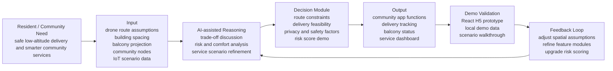

# AI Product Flow Diagram

This diagram explains Cloud Alley as a low-altitude smart community app prototype with an AI-assisted decision layer.

## Product Manager Reading

- **User problem:** Residential low-altitude services need clear safety, comfort, and service-efficiency logic.
- **AI role:** Support trade-off reasoning across route, spacing, balcony, and masterplan factors.
- **Output value:** Translate spatial decisions into user-facing app modules.
- **Validation:** The H5 prototype demonstrates the service scenario and can later connect to a stronger risk-scoring module.
